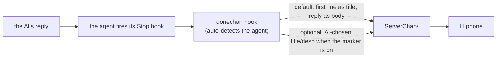

<div align="center">

# DoneChan

**The AI tells you itself: Your Majesty, your task is done!**

Push task-done notifications to your phone via ServerChan³, so you can be a
better black-hearted emperor.

Works with: **ZCode · Codex · Claude Code · OpenCode · DSH**

[](https://github.com/SnowSwordScholar/DoneChan/actions/workflows/ci.yml)
[](LICENSE)
[](package.json)

[简体中文](README.md) | English

</div>

---

## What is DoneChan

As a black-hearted big boss, you abhor the moment your agents finish the work
and then slack off, so you keep a constant watch over them. But there are
always times when you step out for dinner or lie down in bed, and then you
can't watch them closely. DoneChan gives you, the boss, a proper way to know
when a task is done — it pushes a ServerChan³ notification to your phone. In
bed or out for dinner, you'll know your "employee" has finished and you can
hand down the next task before they slack off.

> Community project, not affiliated with ZCode, OpenAI, or Anthropic.

## How it works



Three-layer content strategy (only the first is on by default):

1. **The reply itself** — title is the first line, body is the whole reply, and
   ServerChan renders that Markdown. The AI writes nothing extra.
2. **Marker protocol (optional, off by default)** — enable it when you want the
   AI to curate the title/summary (`donechan install <agent> --skill` plus
   `donechan config marker_enabled true`); the cost is a JSON blob on every
   completion.
3. **LLM summary** — planned for later, using an extra API key.

## Install

```bash
npm install -g donechan
```

Or from source:

```bash
git clone https://github.com/SnowSwordScholar/DoneChan.git
cd DoneChan && npm i && npm run build
npm link        # put donechan on your PATH
```

Configure your SendKey (get one at
[sc3.ft07.com/sendkey](https://sc3.ft07.com/sendkey)):

```bash
donechan login sctp12345tXXXXXXXXXXXXXXXX
donechan send "hello"        # you should receive it now
```

> Legacy ServerChan Turbo keys (`SCT…`) are auto-routed too.

## Wire up your agent

**Easiest: let your AI agent install it** (this repo is designed to be
agent-readable):

```text
Clone https://github.com/SnowSwordScholar/DoneChan, follow its README to wire
donechan into your Stop hook (the marker protocol is optional and off by default).
```

**Manual** — `donechan install <agent>` writes interactively (shows the plan
and asks for confirmation first; `--print` only prints):

| Agent | What to do |
|---|---|
| ZCode | Merge into `~/.zcode/cli/config.json`; or use the `adapters/zcode/plugin/` plugin bundle (hooks auto-enabled) |
| Codex | Write to `~/.codex/hooks.json` (trust prompt on first load is expected); legacy versions: `adapters/codex/notify.toml` |
| Claude Code | Merge into `~/.claude/settings.json` |
| OpenCode | Write the `~/.config/opencode/plugins/donechan.js` plugin (OpenCode has no Stop hook; it uses the `session.idle` event) |
| DSH | Install the native plugin into `$DSH_HOME/profiles/<profile>/node_modules/donechan-dsh` and mount it (restart dsh to activate). The plugin reads what the agent already said, so DSH needs no marker protocol |

**The notification is the AI's own reply** (title = first line, body = the reply,
which ServerChan renders as Markdown), so the model writes nothing extra and
spends no extra tokens.

## Let the AI define the notification (optional, off by default)

Turn this on only when you want the AI to curate the title/summary itself. Know
the cost first: the model then emits a JSON blob on every completion, and the
reply already carries that content — for most people this is redundant.

Enabling takes **two** steps (either alone does nothing useful):

```bash
donechan install <agent> --skill        # teach the AI to write markers
donechan config marker_enabled true     # make DoneChan read them
```

The first step alone means the AI writes markers nobody reads; the second alone
means nothing is written to read.

Coming from an older install that already has the skill:

```bash
donechan uninstall <agent|all>          # remove the marker skill (wiring untouched)
```

Once enabled, the AI appends this to its final reply (the comment is invisible
to humans; the content is pushed verbatim):

```html
<!--donechan: {"title": "✅ Payment callback bug fixed", "desp": "**Fix**: idempotency check added\n**Regression**: 12/12 passed\n**Risk**: re-verify in sandbox", "short": "Duplicate-charge bug fixed", "tags": "backend|bugfix"}-->
```

Fields: `title` (required) · `desp` Markdown body · `short` card summary ·
`tags` pipe-separated labels.

Codex uses a separate skill and must not emit HTML comments (Codex renders them
visibly). Install `skills/donechan-notify-codex` as `~/.codex/skills/donechan-notify`
and encode the same JSON as a base64url hidden link:

```text
[](donechan://<base64url(JSON)>)
```

## CLI

```
donechan hook              unified hook entry (stdin or argv JSON), fire-and-forget
donechan send [title]      send a test notification (-b for body)
donechan check             validate the configuration
donechan install <agent|all>   interactive wiring (zcode | codex | claude | opencode | dsh); --print only prints, --skill also installs the marker skill
donechan uninstall <agent|all> remove the marker skill (wiring untouched)
donechan config             view/set config keys (sendkey, title_prefix, tags, marker_tags_enabled, marker_enabled)
donechan login <sendkey>   write the SendKey to ~/.donechan/config.json
```

## Configuration

| Precedence | Source | Notes |
|---|---|---|
| 1 | `DONECHAN_SENDKEY` env var | ad-hoc use, CI |
| 2 | `<repo>/.donechan/config.json` | team-shared (never commit real keys) |
| 3 | `~/.donechan/config.json` | personal default |

```json
{ "sendkey": "sctp12345t...", "title_prefix": "[DoneChan]", "tags": "dev" }
```

## Troubleshooting

| Symptom | Fix |
|---|---|
| No push received | `donechan check` + `donechan send t`; the key must start with `sctp` or `SCT` |
| Hook not firing in ZCode | config-file hooks need `"enabled": true` (the plugin form enables it automatically) |
| Codex trust prompt | expected; review the command before trusting |
| AI forgets the marker | the marker protocol is off by default and the push already carries the reply — nothing to fix |
| No notification from DSH | the plugin loads at dsh startup: restart dsh after installing, and re-run `donechan install dsh` after upgrading donechan |
| No notification from OpenCode | upstream bug in OpenCode 1.14.x: the plugin loads but events (`session.idle` etc.) are never dispatched; waiting for an OpenCode fix |

## Contributing

PRs welcome; read [CONTRIBUTING.md](CONTRIBUTING.md) before submitting.

## License

[MIT](LICENSE) © DoneChan contributors

## Acknowledgements

- [ServerChan³](https://sc3.ft07.com) — the push service
- Inspired by hooks notifiers in the Claude Code & ZCode ecosystems
