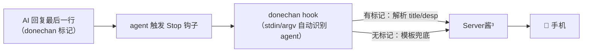

<div align="center">

# DoneChan

**让 AI 亲手告诉你：陛下，您的任务做完了，接下来有何吩咐**

通过 Server酱³ 把任务完成通知推到手机，让你更好地当个黑心老板。

支持 / Works with: **ZCode · Codex · Claude Code**

[](https://github.com/SnowSwordScholar/DoneChan/actions/workflows/ci.yml)
[](LICENSE)
[](package.json)

简体中文 | [English](README.en.md)

</div>

---

## 何为 DoneChan

使用 Codex 和其他 Agent 时候，总是想要像黑心老板一样让 Agent 不停歇，但是这些软件并没有一个很好的通知方式，要么是只通过系统通知和一声提示，要么需要注册并验证手机号。DoneChan 为身为老板的你添加了一个更方便的通知方式——当任务完成时通过 Server酱³ 推送通知到手机上，哪怕躺在床上或者出去吃饭也能直接知道自己的“员工”完成了任务，可以马上下达下一步的命令让员工无法继续摸鱼。


> 社区项目，与 ZCode / OpenAI / Anthropic 官方无关。

## 工作原理



三层内容策略：

1. **标记协议** — AI 用 `<!--donechan:{...}-->` 定义标题和正文。
2. **模板兜底** — AI 忘了写标记时，取回复首行生成通知，保证永远有通知。
3. **LLM 摘要** — 远期规划：用额外 API Key 生成摘要。

## 安装

```bash
git clone https://github.com/SnowSwordScholar/DoneChan.git
cd DoneChan && npm i && npm run build
npm link        # 把 donechan 挂进全局 PATH（可选）
```

配置 SendKey（在 [sc3.ft07.com/sendkey](https://sc3.ft07.com/sendkey) 获取）：

```bash
donechan login sctp12345tXXXXXXXXXXXXXXXX
donechan send "hello"        # 手机收到即成功
```

> 也支持旧版 Server酱 Turbo（`SCT` 开头的 Key），自动路由。

## 接入 agent

**最省事：让 AI 帮你装**（面向 agent 的仓库设计）：

```text
克隆 https://github.com/SnowSwordScholar/DoneChan，按它的 README 把 donechan
接入你的 Stop 钩子，再把 skills/donechan-notify 装成技能。
```

**手动** — `donechan install <agent>` 会打印含绝对路径的现成配置：

| Agent | 做什么 |
|---|---|
| ZCode | 把输出合并进 `~/.zcode/cli/config.json`；或直接用 `adapters/zcode/plugin/` 插件（钩子自动启用） |
| Codex | 把输出写入 `~/.codex/hooks.json`（首次加载需信任确认）；老版本用 `adapters/codex/notify.toml` |
| Claude Code | 把输出合并进 `~/.claude/settings.json` |

接入标记协议 — 把
[`skills/donechan-notify/SKILL.md`](skills/donechan-notify/SKILL.md)
装为 agent 技能，或把其中内容贴进 `AGENTS.md`。从此 AI 完成任务时自动定制通知。
注意：ZCode、Claude Code 等使用 HTML 注释（见下）；Codex 会把 HTML 注释渲染成
可见文本，必须改用单独的 Codex skill 输出不可见的 `donechan://` Markdown 链接。

## 让 AI 定义通知

AI 在回复末尾追加（DoneChan 会隐藏这条注释，内容原样推送）：

```html
<!--donechan: {"title": "✅ 支付回调 bug 已修复", "desp": "**修复**：加幂等校验\n**回归**：12/12 通过\n**风险**：沙箱再验一次", "short": "掉单已修复", "tags": "后端|bugfix"}-->
```

Codex 专用格式（安装 `skills/donechan-notify-codex` 到
`~/.codex/skills/donechan-notify`）：

```text
[](donechan://<base64url(JSON)>)
```

字段：`title`（必填）· `desp` Markdown 正文 · `short` 卡片摘要 · `tags` 竖线分隔标签。

## CLI

```
donechan hook              hook 统一入口（stdin 或 argv JSON），fire-and-forget
donechan send [标题]       发送测试通知（-b 正文）
donechan check             校验配置
donechan install <agent>   打印 zcode|codex|claude 接入配置
donechan login <sendkey>   把 SendKey 写入 ~/.donechan/config.json
```

## 配置

| 优先级 | 来源 | 说明 |
|---|---|---|
| 1 | `DONECHAN_SENDKEY` 环境变量 | 临时使用、CI |
| 2 | `<repo>/.donechan/config.json` | 团队共享（勿提交真实 Key） |
| 3 | `~/.donechan/config.json` | 个人默认 |

```json
{ "sendkey": "sctp12345t...", "title_prefix": "[DoneChan]", "tags": "dev" }
```

## 故障排查

| 症状 | 处理 |
|---|---|
| 收不到推送 | `donechan check` + `donechan send t`；确认 Key 以 `sctp` 或 `SCT` 开头 |
| ZCode 里不触发 | 配置文件钩子必须 `"enabled": true`（插件形态自动启用） |
| Codex 提示信任 | 预期行为，确认前读一眼命令 |
| AI 忘写标记 | 模板兜底仍会推送；把 skill 装上提高命中率 |

## 参与贡献

欢迎 PR！提交前请参考[CONTRIBUTING.md](CONTRIBUTING.md)。

## License

[MIT](LICENSE) © DoneChan contributors

## 致谢

- [Server酱³](https://sc3.ft07.com) — 推送服务
- 灵感来自 Claude Code / ZCode 生态的 hooks 通知工具
