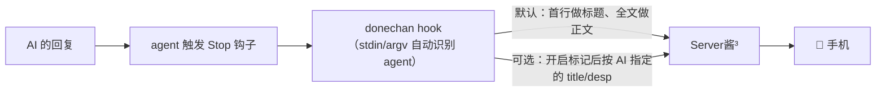

<div align="center">

# DoneChan

**让 AI 亲手告诉你：皇上，您的任务完成了！**

通过 Server酱³ 把任务完成通知推到手机，让你更好地当个黑心皇上。

支持 / Works with: **ZCode · Codex · Claude Code · OpenCode · DSH**

[](https://github.com/SnowSwordScholar/DoneChan/actions/workflows/ci.yml)
[](LICENSE)
[](package.json)

简体中文 | [English](README.en.md)

</div>

---

## 何为 DoneChan

身为黑心大老板，对于自己的 Agent 把活做完消极怠工是深恶痛绝的，我们通常会一直监视 Agent 工作。但是总会有时候出去吃饭，上床躺着，这个时候并不能有效的监控 Agent 。
DoneChan 为身为老板的你添加了一个更方便的通知方式——当任务完成时通过 Server酱³ 推送通知到手机上，哪怕躺在床上或者出去吃饭也能直接知道自己的“员工”完成了任务，可以马上下达下一步的命令让员工无法继续摸鱼。


> 社区项目，与 ZCode / OpenAI / Anthropic 官方无关。

## 工作原理



三层内容策略（默认只用第一层）：

1. **回复本身** — 标题取回复首行、正文是回复全文，ServerChan 原生渲染 Markdown。
   AI 不需要多写一个字。
2. **标记协议（可选，默认关闭）** — 想让 AI 自己定制标题/摘要时再开启
   （`donechan install <agent> --skill` + `donechan config marker_enabled true`）；
   代价是 AI 每轮多输出一段 JSON。
3. **LLM 摘要** — 远期规划：用额外 API Key 生成摘要。

## 安装

```bash
npm install -g donechan
```

或者从源码安装：

```bash
git clone https://github.com/SnowSwordScholar/DoneChan.git
cd DoneChan && npm i && npm run build
npm link        # 把 donechan 挂进全局 PATH
```

配置 SendKey（在 [sc3.ft07.com/sendkey](https://sc3.ft07.com/sendkey) 获取）：

```bash
donechan login sctp12345tXXXXXXXXXXXXXXXX
donechan send "hello"        # 手机收到即成功
```

> 也支持旧版 Server酱 Turbo（`SCT` 开头的 Key），自动路由。

## 接入 agent

**最省事：让 AI 帮你装**（面向 agent 的仓库设计）：

```text
克隆 https://github.com/SnowSwordScholar/DoneChan，按它的 README 把 donechan
接入你的 Stop 钩子（标记协议是可选功能，默认不需要）。
```

**手动** — `donechan install <agent>` 交互式写入（先展示计划、确认后才写，`--print` 只打印）：

| Agent | 做什么 |
|---|---|
| ZCode | 合并进 `~/.zcode/cli/config.json`；或直接用 `adapters/zcode/plugin/` 插件（钩子自动启用） |
| Codex | 写入 `~/.codex/hooks.json`（首次加载需信任确认）；老版本用 `adapters/codex/notify.toml` |
| Claude Code | 合并进 `~/.claude/settings.json` |
| OpenCode | 写入 `~/.config/opencode/plugins/donechan.js` 插件（OpenCode 没有 Stop 钩子，走 `session.idle` 事件） |
| DSH | 安装原生插件到 `$DSH_HOME/profiles/<profile>/node_modules/donechan-dsh` 并挂载（重启 dsh 生效）。插件直接读 AI 的原话，因此 DSH 上不需要标记协议 |

**通知内容默认就是 AI 回复本身**（标题取首行，正文是回复全文，ServerChan 原生渲染 Markdown），
不需要 AI 额外写任何东西，也就不花额外 Token。

## 让 AI 定义通知（可选，默认关闭）

想让 AI 自己定制通知标题/摘要时再开启。**开启前请先知道代价**：AI 每轮要多输出一段 JSON，
而且回复本身其实已经包含了这些内容 —— 多数情况下是多余的。

开启两步（缺一不可）：

```bash
donechan install <agent> --skill        # 装技能，教 AI 写标记
donechan config marker_enabled true     # 让 DoneChan 去读标记
```

只做第一步的话，AI 会白写标记（没人读）；只做第二步则什么也不会发生。

老版本装过技能、现在想关掉：

```bash
donechan uninstall <agent|all>          # 移除标记技能（不动钩子配置）
```

开启后，AI 在回复末尾追加（DoneChan 会隐藏这条注释，内容原样推送）：

```html
<!--donechan: {"title": "✅ 支付回调 bug 已修复", "desp": "**修复**：加幂等校验\n**回归**：12/12 通过\n**风险**：沙箱再验一次", "short": "掉单已修复", "tags": "后端|bugfix"}-->
```

Codex 专用格式（安装 `skills/donechan-notify-codex` 到
`~/.codex/skills/donechan-notify`）：

```text
[](donechan://<base64url(JSON)>)
```

字段：`title`（必填）· `desp` Markdown 正文 · `short` 卡片摘要 · `tags` 竖线分隔标签。

## CLI

```
donechan hook              hook 统一入口（stdin 或 argv JSON），fire-and-forget
donechan send [标题]       发送测试通知（-b 正文）
donechan check             校验配置
donechan install <agent|all>  交互式接入（zcode | codex | claude | opencode | dsh）；--print 只打印，--skill 额外装标记技能
donechan uninstall <agent|all> 移除标记技能（不动钩子配置）
donechan config            查看/设置配置项（sendkey、title_prefix、tags、marker_tags_enabled、marker_enabled）
donechan login <sendkey>   把 SendKey 写入 ~/.donechan/config.json
```

## 配置

| 优先级 | 来源 | 说明 |
|---|---|---|
| 1 | `DONECHAN_SENDKEY` 环境变量 | 临时使用、CI |
| 2 | `<repo>/.donechan/config.json` | 团队共享（勿提交真实 Key） |
| 3 | `~/.donechan/config.json` | 个人默认 |

```json
{ "sendkey": "sctp12345t...", "title_prefix": "[DoneChan]", "tags": "dev" }
```

## 故障排查

| 症状 | 处理 |
|---|---|
| 收不到推送 | `donechan check` + `donechan send t`；确认 Key 以 `sctp` 或 `SCT` 开头 |
| ZCode 里不触发 | 配置文件钩子必须 `"enabled": true`（插件形态自动启用） |
| Codex 提示信任 | 预期行为，确认前读一眼命令 |
| AI 忘写标记 | 标记协议默认关闭，通知本来就用 AI 的回复本身，无需处理 |
| DSH 收不到通知 | 插件在 dsh 启动时加载：装完要重启 dsh；升级 donechan 后重跑 `donechan install dsh` |
| OpenCode 收不到通知 | OpenCode 1.14.x 上游 bug：插件正常加载但事件（`session.idle` 等）不派发，等待上游修复 |

## 参与贡献

欢迎 PR！提交前请参考[CONTRIBUTING.md](CONTRIBUTING.md)。

## License

[MIT](LICENSE) © DoneChan contributors

## 致谢

- [Server酱³](https://sc3.ft07.com) — 推送服务
- 灵感来自 Claude Code / ZCode 生态的 hooks 通知工具
